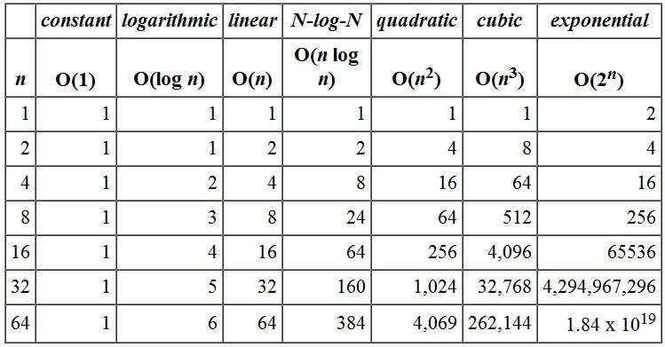
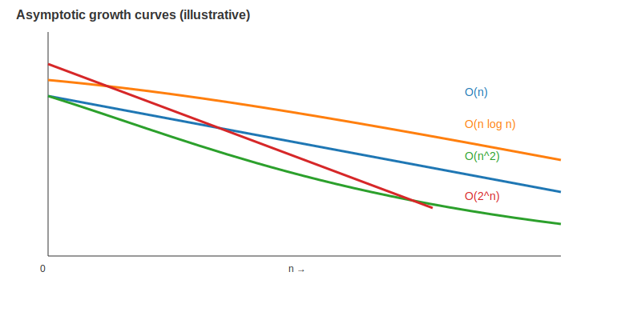

## Asymptotic Analysis: Overview and Limitations

Asymptotic analysis attempts to compute the time period of any operation in
mathematical units of computation.

It attempts to estimate the resource consumption of the operation. Typically,
you will analyze the time required for an algorithm and the space required for
data.

The commonly used asymptotic notations to calculate the running time complexity
of an algorithm are:

- **Big-Omega (Ω)** — best case (minimum time required for program execution).
- **Big-Theta (Θ)** — average case (average time required for program execution).
- **Big-O (O)** — worst case (maximum time required for program execution).

### How Do We Measure The Performance Value Of Algorithms?

Big O Notation is commonly used to know the maximum time required for program
execution and it is basically only a mathematical analysis to provide a reference
on the resources consumed by the algorithm.

• Big O describes how the time taken, or memory used, by a program scales
with the amount of data it has to work on.

Complete algorithm analysis is impossible. In fact, it is not even possible to
tell whether an algorithm will finish. Fortunately, most useful algorithms are
subject to fairly straightforward asymptotic analysis.

In most general cases, algorithm analysis is important. Despite the importance
of algorithm analysis, it has its limitations.

Algorithms with better complexity are often more complicated. This can increase
coding time and the constants.

The majority of algorithmic tasks in practice do not deal with large data and in
most cases a much simpler algorithm could be better even though it might not be
relatively faster compared to the complex algorithm.

Asymptotic analysis does not consider small input cases as carefully as it
considers other cases with higher input. Considering small input sizes, constant
factors or low order terms could dominate running time, causing one algorithm to
outperform another even if Big-O says they are the same.

*Illustrative runtimes showing O(n), O(n log n), O(n^2), and O(2^n). Image source: [Cal Poly Pomona CS240 lectures](https://www.cpp.edu/~ftang/courses/CS240/lectures/analysis.htm) — original image was unavailable, so an illustrative graphic is used.*

For example, the running time of one operation may be computed as f(n²) and for
another operation it may be computed as g(2^n). For small n the first operation
may be acceptable while the second is impractical for larger n. In a similar
manner, the running time of both operations will be nearly the same if n is
significantly small.

*Illustrative growth curves showing O(n), O(n log n), O(n^2), and O(2^n). Image source: [Cal Poly Pomona CS240 lectures](https://www.cpp.edu/~ftang/courses/CS240/lectures/analysis.htm) — original image was unavailable, so an illustrative graphic is used.*

Constant factors are always ignored in asymptotic analysis for most algorithm
comparisons. In certain cases, when running an algorithm on smaller input, the
constants can have a large effect when comparing algorithms. For instance, if
the problem is to sort a collection of seven records, then an algorithm designed
for sorting millions of records is probably not appropriate, even though it might
have an asymptotic analysis that indicates good performance. If one algorithm
takes O(n) time to execute and the other takes O(100000n) time to execute, then
per Big O both algorithms have equal time complexity. In real-time application
systems this may be a serious consideration — Big-O analysis often hides true
costs of operations involved in the algorithm.

The running time of an algorithm depends on how long it takes a computer to run
the lines of code of the algorithm and that depends on many other factors
including the speed of the computer, the programming language, and the compiler
that translates the program.

Asymptotic analysis might not be the ideal method for selecting an algorithm but
it gives the programmer enough information. That said, asymptotic performance
analysis can be quite helpful as the starting point for reasoning about the
performance of algorithms and data structures; one must understand its
limitations to be a competent and better programmer.

## References

- [Cal Poly Pomona — CS240: Algorithm Analysis (mentioned image source)](https://www.cpp.edu/~ftang/courses/CS240/lectures/analysis.htm)
- [Asymptotic analysis — Wikipedia](https://en.wikipedia.org/wiki/Asymptotic_analysis)
- [Introduction to Algorithms (CLRS)](https://mitpress.mit.edu/9780262046305/introduction-to-algorithms/)

---

*Originally published on [Medium](https://medium.com/@rexfordmachu/asymptotic-analysis-overview-and-limitations-d8f40f651e35) — Jul 17, 2021.*
