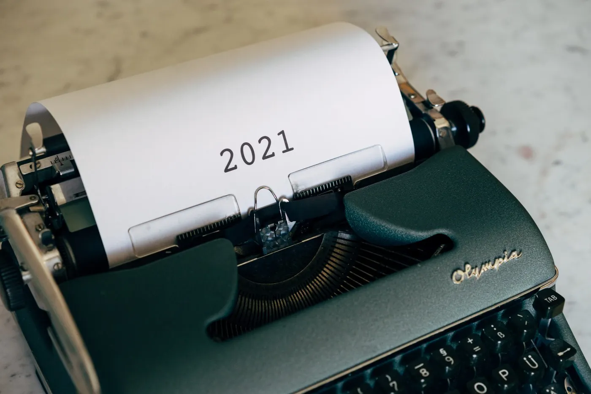

 

Photo by [Markus Winkler](https://unsplash.com/@markuswinkler) on Unsplash

I got encouraged to do this after reading [Clinton Mbah’s blog](https://blog.clintonmbah.com/personal/year_review.html) earlier this year.

This year was great in every way. I grew in every way I could think of. I became open to challenges and trying new things in all aspects. I bcame more curious and questioned a lot of things so i could know more.

The year had times when I was just low on fuel. School was extremely hectic. After the pandemic and restrictions the previous year , we were plunged into one tiring 9 month school year😣, Imagine what that does to your mental state.

My highlight reel for the year? I believe this year was exceptional and maybe I can remember a few of the moments(Pretty eventful year, i can’t remember all).

✍🏽 I wrote more this year. I became more intentional about documenting and involved myself in writing more this year. My journal and blog space show the stats were crashed. A great thing about writing is you get to arrange and filter your thoughts, get to share my experiences with others and help people live in your moment. I also did some contract writing🤑.

☁️I started learning cloud engineering and passed as an AWS Certified Cloud Practitioner. I had originally planned to write the exam next year but AWS rolled out a free challenge to Africa and I just had to take advantage to save cost. Read the article here.

👾I learnt three new languages during the year. I learnt Java and C++, both for school course work and currently learning Golang due to a concurrency curiosity i plan on satisfying.

♣️I won a presidential election in my university as the Vice President and can’t wait to effect the changes planned out once my term of office begins officially next year.
I became much more sociable and made a lot of amazing friends and professional connections as a result.

I also became more aware of cryptocurrencies, Web3 and all of its wahala. I started learning to better understand the technologies, as it’s an engineer’s trait.

🎾I missed out on joining the school tennis team because I missed training but then again, I realised I was incapable of keeping up with school, training, playing for the school team and other activities.

📚I continually applied for roles just so I could get into an interview process to be able to measure my growth from someone else’ s view. Made it into only two out of the multitude I sent and I believe I have more work to do.

🧘🏾‍♂️I took my first actual vacation in 3 years to clear the constant activity and noise in my head. This year I planned to be free from work and other responsibilities during our school vacation.

🍜I decided to take the time to explore the city more, eat foods i had on a bucket list and visit places with Didi. I wanted to take time to experience nothing. I was drained from school. My head was not in the right place and I was extremely depressed after August. I just wanted to feel nothing.

🧑🏾‍💻I finished the infrastructure and idea write up for projects I have been wanting to build. About 40% done. I know I haven’t done enough but itizwhatitizzz.
🏋🏾‍♂️Worked on a major client gig and they absolutely loved me. I really liked the team and had the opportunity to spearhead the project. I made money i didn’t think was possible at my current career stage. I guess i just needed more production experience.

📈I leveled up as a developer and person generally. I became intentional about the progress of others. I would introduce them to areas I believed they would excel in. I gathered and shared resources I believed would help them out and continued encouraging them when they would hit a roadblock.

😟I went to the gym for a day but I think I’m not actually prepared to be in that place now as I have other priorities I feel come before. I mean I could go to the gym next year but some opportunities are/were not always going to be available to me.

🔑I did a lot of learning and unlearning about relating better to others, self-love, happiness, theism and professional development among other important topics/issues. I also did a lot of introspection about harmful social media habits I had picked up, becoming a kinder person, a framework for my happiness and success, having control over certain elements in my life and what I needed to learn to become an indispensable(10x) developer etc etc. I had to do a lot of reading for this bit from articles, books, and tweets(Twitter really has its upside).

⏭Going into 2022, I have no idea what it has in store for me. I plan to top 2022 overall. Excel in school, excel as a software engineer, intensify my casanova and development phase, mental strength and fall in love, be an even better friend to my amazing friends, be an exceptional colleague and not die among other things. Hopefully everything works out. If not, I believe we will all be fine eventually and we try again.

**My favourite words. Nothing Ventured, Nothing Gained!**