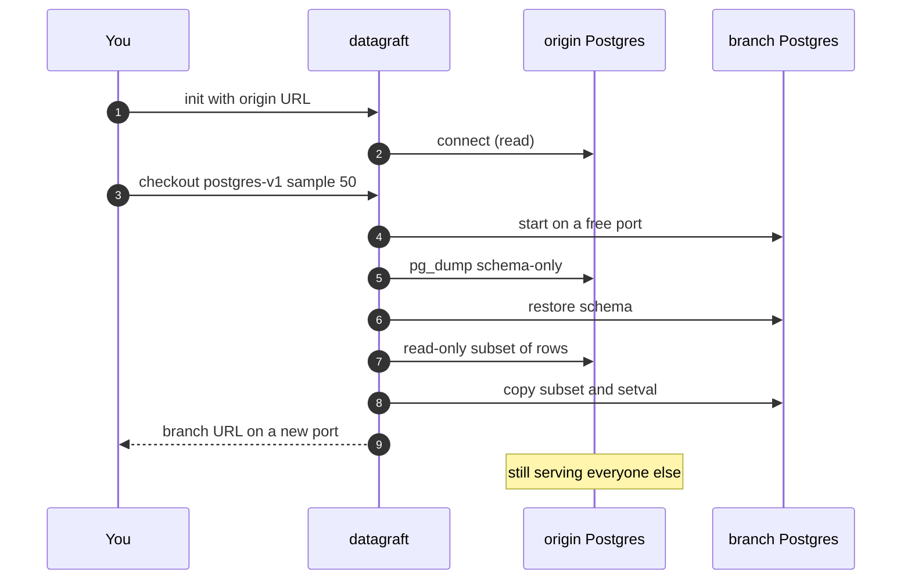

**Datagraft** is `git checkout` for a live PostgreSQL: fork the database you already have into an isolated server, optionally take ~N rows instead of the whole thing, and leave origin up. It is not a new engine, not a cluster, and not merge. A branch is a second Postgres. Reset recreates it. There is no `datagraft merge`.

```bash
datagraft checkout postgres-v1 --sample 50
```

```
                    never written
                         │
   origin  ──────────────┤  :5432   1,000,000 rows
                         │
   postgres-v1  ─────────┘  :5435          50 rows   ← yours
         │
         ALTER TABLE, bad migrations, seed experiments
```

This is still an experiment. The pass condition is a real app booting on that fork. If that loop does not stick, merge and remotes are not worth building.

## Why I built it

Code is branched. The database usually is not.

I kept hitting that on a particular app: EF Core, uuid primary keys, jsonb, quoted `"Id"` columns, dual FKs to `users`. Every “what if we add this column,” every migration, every seed experiment either ran against the shared Postgres or waited until staging. QA and other developers ate the blast radius, or nobody tried anything. The workaround was `pg_dump` / restore: slow, stale, still one copy. You cannot have `postgres-v1` and `broken-fk-experiment` at the same time without two restores.

Hosted branching (Neon, Postgres.ai) isolates in the cloud. It is not a laptop CLI, and it does not make the data smaller. Git-like engines (Doltgres) solve merge by not being Postgres. The app’s extensions, SQL, and ORM are not the same product.

I wanted the gap in between: real Postgres, installable, isolated, optionally fifty rows. That app’s schema was the first the experiment had to survive. Checkout in about five seconds. Isolation held — DDL on the fork never appeared on origin. App-boot SQL passed. The app process itself is still the next proof.

I did not want a Kubernetes operator, a CoW volume clone, or a fake merge. I wanted `datagraft checkout` the way I already `git checkout`. Reset is how you iterate. Merge waits until a real boot says otherwise.

## Tech Stack

- **Go** — installable CLI (`datagraft`), no cluster required
- **PostgreSQL** — the engine is real Postgres; schema via `pg_dump --schema-only`, data via a logical subset
- **Docker or local `pg_ctl`** — throwaway postmaster on a free port; Docker if the daemon answers in 3s, else Homebrew-style local Postgres
- **FK-safe sampler** — topological copy, PK required, parents before children; dual FKs close the other side instead of AND-sampling to zero rows

## Architecture Overview

Datagraft never writes origin. Isolation is a second postmaster, not a `DELETE` that “makes it smaller.”

1. **`init`** — records origin (read-only from here on). Hosts that look like RDS / Neon / Supabase are refused unless you pass `--i-know`
2. **`checkout`** — starts a throwaway Postgres on a free port (never origin’s). Restores schema, then copies an FK-closed subset if `--sample N` is set
3. **Keep / seed** — `--keep-pk` and `--include-sql` keep the admin user, migrations table, and other rows the app needs to start
4. **`reset`** — throws the instance away and rebuilds it. That is the iterate loop. Not merge
5. **State** — `.datagraft/state.json` plus metrics; `env` / `status` / `diff` / `drop` / `gc` around the same model



An early design treated this as GitOps CRDs and a Kubernetes operator. That failed the install-and-run test. The interface is a CLI. GitOps, if it ever appears, wraps the same binary.

## Key Features

- **Named branches** — `checkout postgres-v1` is a second server, not a schema prefix on origin
- **`--sample N`** — logical copy of ~N rows plus FK parents; small forks are actually small
- **`--keep-pk` / `--include-sql`** — keep the rows a real app needs (admin, `schema_migrations`)
- **Reset, not merge** — recreate the fork from parent with the same sample policy
- **Origin stays up** — other clients keep their URL; origin port is never stolen
- **Safety rails** — refuse prod-looking hosts unless `--i-know`; origin credentials are not the printed branch URL
- **Doctor / status / env / diff** — explain failed checkouts, remind you origin still has N rows, point the app at the fork

## What this is not

Not Neon. Not Doltgres. Not a Kubernetes operator. Not CoW volume clones. Not merge, remotes, or GitOps. Those are deferred until `reset` plus a real app boot say the loop is worth keeping.

## Try it

Needs Go 1.25+, `pg_dump` / `psql`, and either Docker or Homebrew `postgresql@16`.

```bash
go install github.com/machugram/datagraft/cmd/datagraft@latest

datagraft doctor
datagraft init --url postgres://localhost:5432/app
datagraft checkout postgres-v1 --sample 50
eval "$(datagraft env)"
datagraft reset postgres-v1
```
