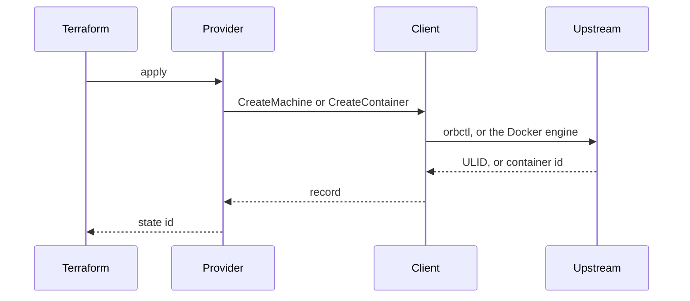

**OrbStack Provider** is a Terraform provider for [OrbStack](https://orbstack.dev) on macOS. It creates Linux machines through `orbctl` and containers through the Docker engine OrbStack already runs. Published as [`machugram/orbstack`](https://registry.terraform.io/providers/machugram/orbstack/latest) `0.1.2`.

```hcl
resource "orbstack_machine" "dev" {
  name       = "dev"
  image      = "ubuntu:noble"
  cpus       = 2
  memory_mib = 2048
  disk_gib   = 16
}

resource "orbstack_container" "web" {
  name  = "web"
  image = "nginx:latest"
  ports = { "8080" = "80" }
}
```

The longer writeup of the lifecycle rules is [[tech/orbstack-terraform | Two Control Planes on One Mac]].

## Why I built it

I already use OrbStack for a Linux machine and for containers on this Mac. I wanted those in Terraform.

The community OrbStack provider creates a machine and reads `orb info`. CPU, memory, disk, isolation, and mounts stay on the CLI. The Docker provider can run the container, and it asks for an image resource, nested port blocks, and a socket. That is the right tool for a cluster. It is a long file for nginx on port 8080.

I did not want a second Docker provider. I wanted one resource that pulls the image, and a machine resource that can set the limits `orbctl` already accepts.

## Tech Stack

- **Go** — Terraform Plugin Framework provider, module `github.com/machugram/terraform-provider-orbstack`
- **orbctl** — Linux machines: create, limits, rename, power, JSON info
- **Docker Engine API** — containers through `github.com/moby/moby/client` on the OrbStack socket
- **GoReleaser** — a `v*` tag builds the signed GitHub release the Terraform Registry publishes

## Architecture Overview

Terraform only talks to the plugin. The plugin turns a plan into a request and calls a client. It does not build `orbctl` arguments or dial Docker itself.

1. **`internal/provider`** — schema, plan, and state for `orbstack_machine` and `orbstack_container`
2. **`internal/orb`** — `orbctl`: create flags, JSON decoding, limits, cloud-init, rename, power
3. **`internal/docker`** — image pull, container create, ports, volumes, start and stop

Machine state stores the ULID from `orbctl info`, so a rename stays an in-place update. Container state stores the engine container id. `go test` never starts OrbStack.



## Key Features

- **Machines with limits** — CPU, memory, disk, isolation, and mounts on `orbstack_machine`
- **One container resource** — name an image and create pulls it; no separate image resource
- **Honest replace rules** — image, cloud-init, and mounts replace a machine; CPU, memory, and disk update in place
- **Data sources** — `orbstack_machine`, `orbstack_machines`, and `orbstack_container`
- **Offline tests** — argv, JSON, and port mapping are unit-tested without a running OrbStack
- **Registry release** — signed checksums; docs generated from the schema with `tfplugindocs`

Kubernetes, Compose, image builds, custom networks, and file copy are out of this pass. `orbctl push` has no delete, so a file resource would create something Terraform cannot destroy.
