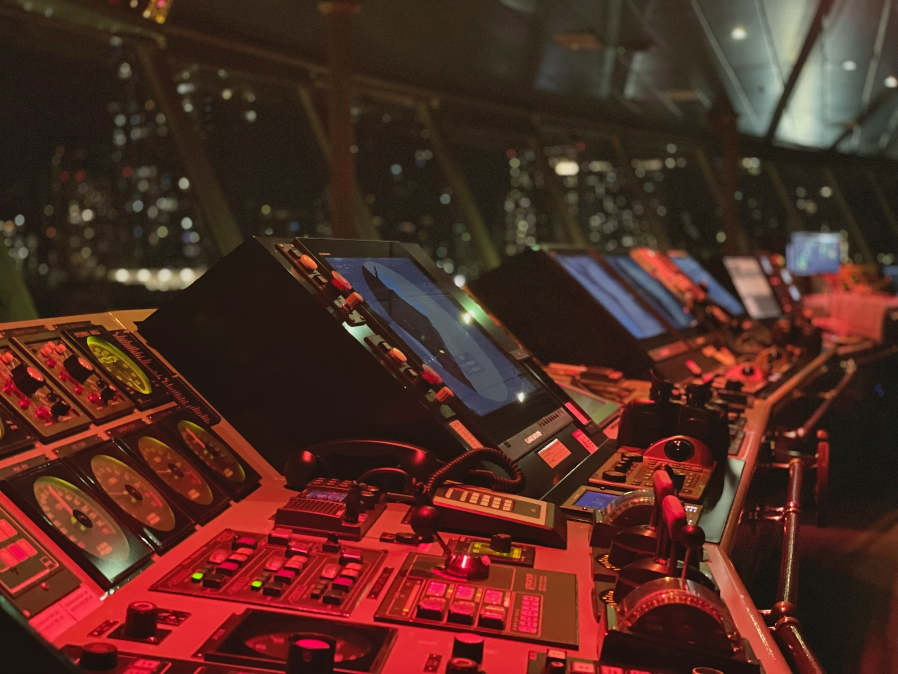
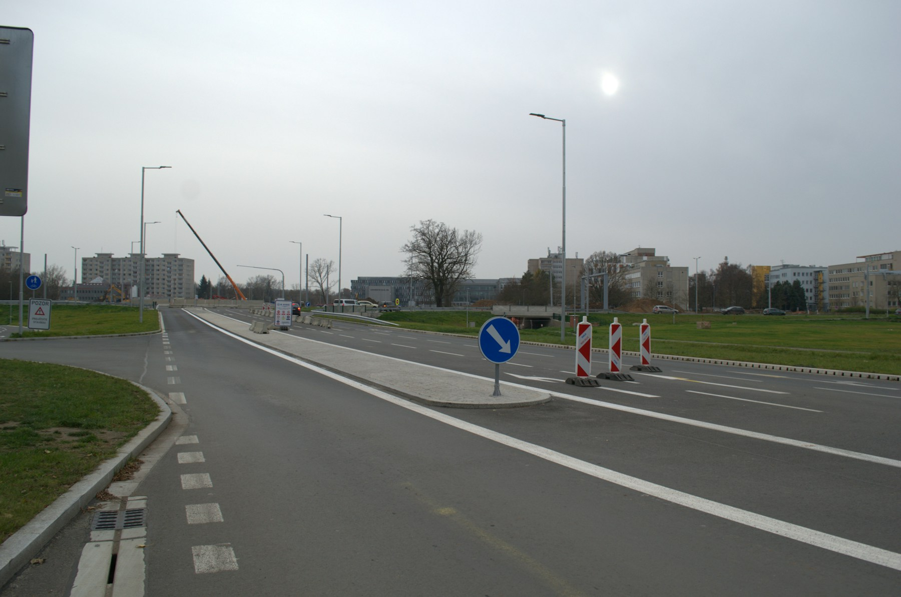
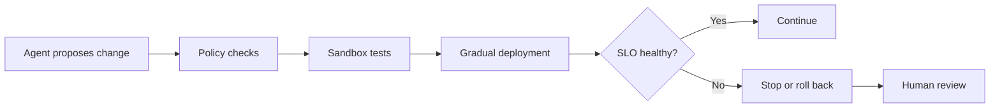
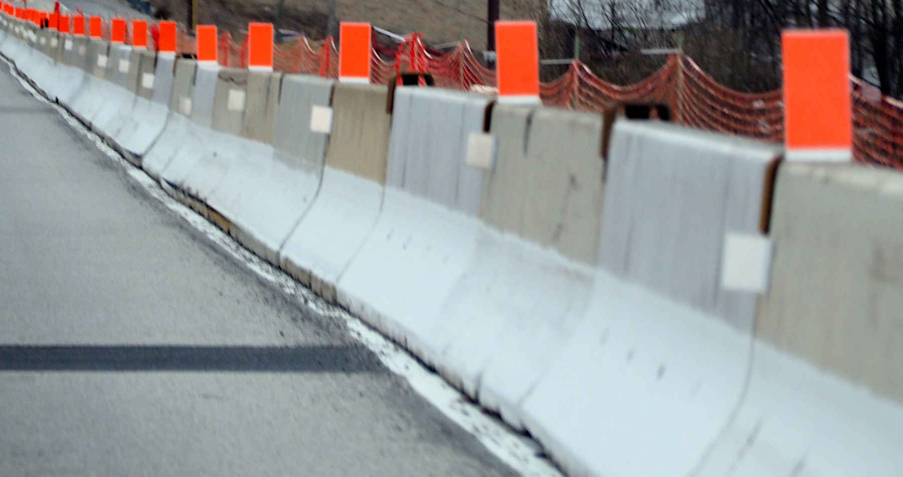

*Part 2 of 2 — [Part 1: When Software Starts Driving Itself](./code-highway)*

*Once agents start driving change, humans spend more time in the control room: setting direction, watching signals, and deciding when to intervene. Photo from [Unsplash](https://unsplash.com/photos/a-control-room-filled-with-lots-of-monitors-qgJCTooDMns).*

In [Part 1](./code-highway), I argued that AI-assisted development is evolving like transportation: from driver assistance toward autonomous fleets. Platforms become traffic-control systems, and reliability becomes the speed limit.

This part is about preparation.

The best preparation is not learning a collection of clever prompts. It is learning how to create systems in which agents can act safely.

## Strengthen Platform Fundamentals

*Platform foundations still have to be paved before autonomous traffic can move safely. Photo by [viktor_rejent on Unsplash](https://unsplash.com/photos/road-construction-with-traffic-cones-and-signs-amwGpIqoS6E).*

Focus on CI/CD, identity, secrets management, policy enforcement, observability, container orchestration, and self-service infrastructure. Autonomous agents will still depend on these foundations.

If the paved road is incomplete, agents will invent shortcuts—and they will invent them quickly.

## Learn Reliability Engineering

Understand service-level objectives, error budgets, capacity planning, progressive delivery, failure isolation, incident response, and disaster recovery.

An agent can generate a successful build and still leave production worse than it found it. Reliability is how you decide whether a change should continue, pause, or reverse.

## Design for Bounded Autonomy

*Bounded autonomy means clear lanes and hard barriers, not unrestricted access. Photo from [Unsplash](https://unsplash.com/photos/road-with-concrete-barriers-and-orange-markers-v7DXSNSXfU4).*

Start agents in a limited operating area. An agent might:

- Modify one repository
- Use only approved dependencies
- Deploy only to development
- Open—but not merge—pull requests
- Stay within a fixed cloud budget

Expand its permissions only when evidence shows the controls work.

Bounded autonomy is the difference between a robotaxi operating in a mapped city and a vehicle given unrestricted highway access because the engine started.

## Make Systems Understandable to Machines

Provide:

- Stable APIs and command-line tools
- Current documentation
- Reusable templates
- Machine-readable schemas
- Clear, predictable errors
- Examples of approved implementations

If engineering practices exist only in people's memories, agents will guess—and they will guess at machine speed.

## Measure Outcomes

Do not count generated lines of code or agent runs as success.

Measure:

- Lead time from idea to production
- Change failure rate
- Deployment success rate
- Mean time to recovery
- Service-level objective attainment
- Security-policy compliance
- Cost per successful change
- Human review and intervention time
- Customer impact

The goal is not to maximize autonomous traffic. It is to help valuable traffic arrive safely.

## A Small Place to Start

Choose a low-risk repository and let an agent handle dependency updates. Require it to:

1. Work on its own branch.
2. Update only approved dependencies.
3. Run tests and security checks.
4. Explain every change.
5. Open a pull request with evidence.
6. Wait for human approval.

Track where it fails and improve the platform, documentation, and policies around those failures. That creates a controlled route to autonomy instead of releasing a fleet directly into production traffic.

## The Road Ahead

Today, AI helps us manufacture more cars. Tomorrow, coding agents may drive them too.

Platform engineering will then become more than highway construction. It will become traffic control for autonomous software fleets.

The organizations best prepared for this future will not remove humans from the process fastest. They will deliberately define where machines can operate, how their work is verified, and when people must intervene.

The future of software engineering is probably not human or AI.

It is humans designing reliable systems in which AI can act safely.

---

Continue from [Part 1: When Software Starts Driving Itself](./code-highway).
