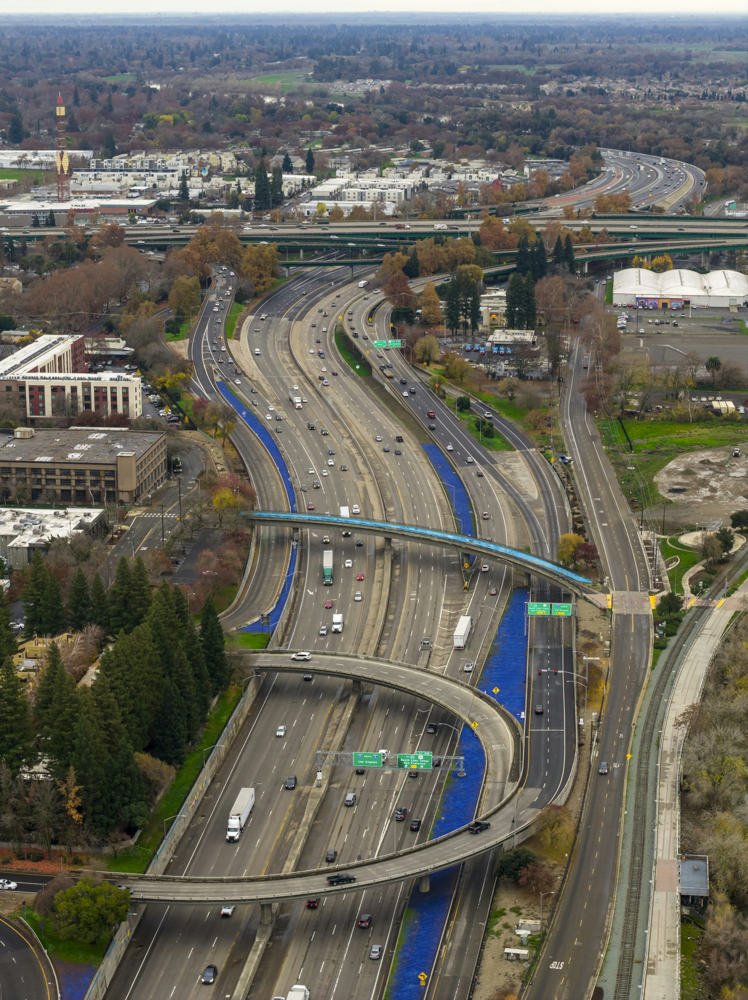
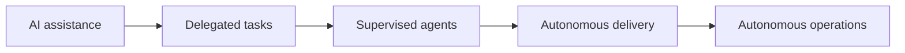
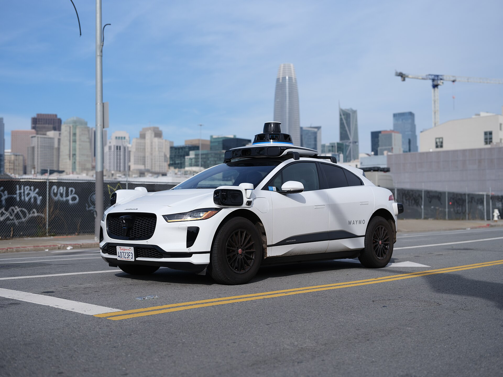
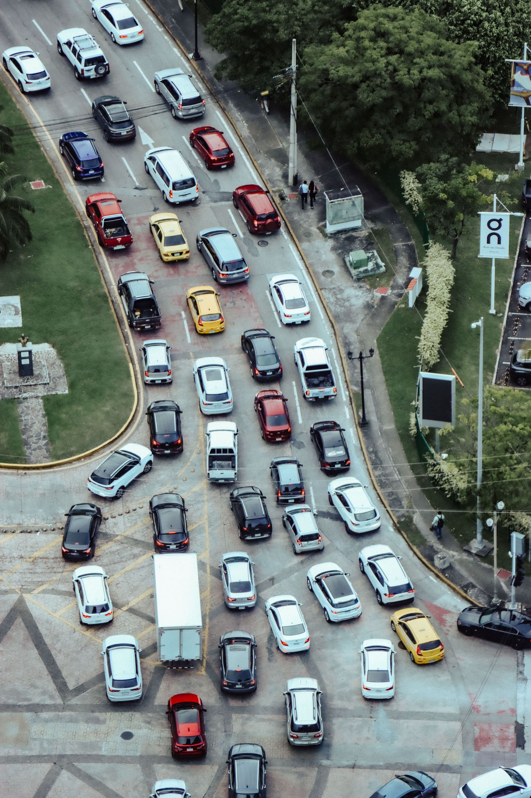
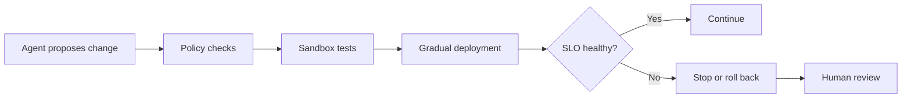

# When Software Starts Driving Itself

*Part 1 of 2 — [Part 2: Preparing for the Autonomous Fleet](./code-highway-part-2)*

*AI is putting more software on the road. Platform engineers must ensure the infrastructure can carry it. Photo by [Leo_Visions on Unsplash](https://unsplash.com/photos/aerial-view-of-a-busy-highway-interchange-with-cars-H-jHl51YFlQ).*

AI-assisted development is starting to look a lot like the evolution of driving.

We began with assistance: navigation, cruise control, and collision warnings. Those tools eventually led to self-driving cars and robotaxis capable of completing journeys with limited human input.

Software development appears to be following the same road.

Today's copilots suggest code and generate tests. Tomorrow's agents will plan changes, modify several systems, open pull requests, deploy software, watch production, and attempt repairs.

In highway terms:

- Copilots assist the driver.
- Coding agents drive the car.
- Multi-agent systems operate fleets.
- Developer platforms provide the roads.
- Reliability engineering sets the safety standards.
- Humans become fleet managers and system designers.

The important question will no longer be, “Can AI write this code?” It will be:

> Can we safely trust thousands of autonomous changes moving through our systems at once?

## From Copilots to Autonomous Fleets

The transition will probably happen in stages:

1. **Assistance:** AI suggests code while a developer controls every important action.
2. **Delegation:** Agents complete bounded tasks, such as fixing a test or upgrading a dependency.
3. **Supervised autonomy:** Agents implement larger changes, respond to reviews, and deploy into controlled environments.
4. **Autonomous operations:** Agents detect problems, validate fixes, deploy gradually, observe reliability signals, and roll back when necessary.

This does not necessarily mean developer-free engineering. It means humans will spend less time driving individual changes and more time deciding where the system should go, what rules govern it, and when autonomous activity must stop.

## Platforms Become Traffic-Control Systems

*Coding agents may evolve from driver assistance into autonomous software fleets. Photo by [Dllu](https://commons.wikimedia.org/wiki/File:Waymo_Jaguar_I-Pace_in_San_Francisco_2023_dllu.jpg), licensed under [CC BY 4.0](https://creativecommons.org/licenses/by/4.0/).*

Robotaxis need more than good driving software. They depend on mapped roads, sensors, traffic laws, operating boundaries, maintenance, remote assistance, and emergency procedures.

Autonomous coding agents will need a similar environment:

- Strong agent identities
- Least-privilege permissions
- Sandboxed execution
- Machine-readable engineering policies
- Approved service templates
- Complete audit trails
- Progressive deployments
- Automatic rollbacks
- Cost and reliability limits
- Emergency stop controls

Giving an agent unrestricted production access because it passed a test suite would be like licensing a robotaxi because it successfully left the garage.

## Reliability Becomes the Speed Limit

*Generating more code does not guarantee delivering more value. Photo by [Luis Quintero on Pexels](https://www.pexels.com/photo/aerial-view-of-a-traffic-jam-18789546/).*

As agents generate more changes, code volume becomes a poor measure of productivity. The real limit is how much change a system can absorb without becoming unstable.

A deployment has not succeeded merely because a command returned exit code zero. Success must include production signals such as latency, error rates, resource saturation, cost, and customer impact.

Autonomous delivery without reliability engineering is simply automated risk.

## What Platform Engineers May Become

Platform engineers are unlikely to disappear. Their work will move to a higher level of abstraction.

Instead of maintaining one pipeline at a time, they will increasingly:

- Design safe operating environments for agents
- Encode security, architecture, and reliability policies
- Define which actions agents may perform independently
- Build feedback systems that stop unsafe changes
- Manage agents across repositories and services
- Investigate failures that cross application and platform boundaries

The role may begin to resemble an autonomous-transportation planner: designing the environment in which machines operate safely instead of controlling every journey.

## Next

Seeing the shift is useful. Acting on it is better.

In [Part 2](./code-highway-part-2), I cover how I’m preparing for this future: the skills to build, the autonomy boundaries to set, and a small experiment you can run without releasing a fleet into production.
