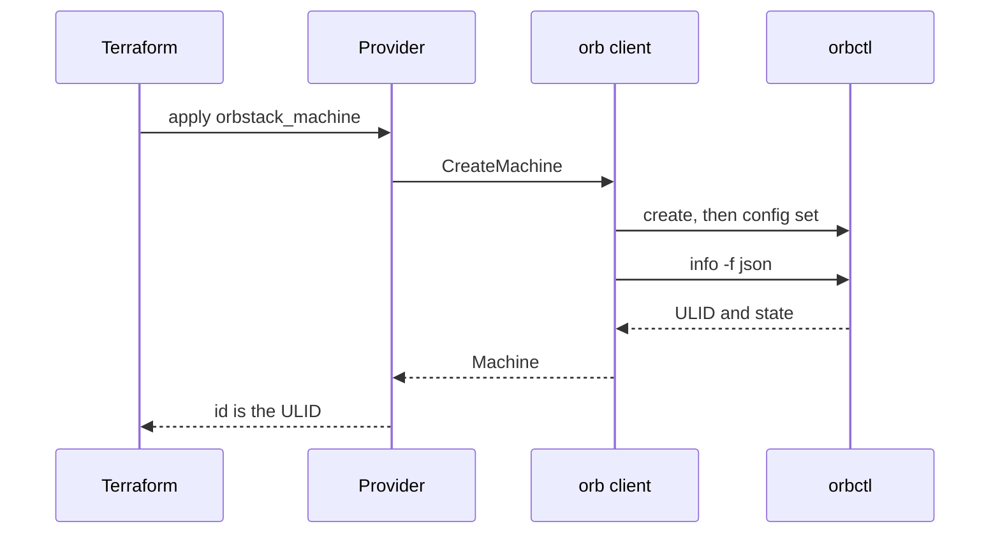

Thinking about a homelab, I realized I needed a trail of the setups. A machine from last month should be a file I can read, plan, and apply again. Terraform is that trail. The first gap was OrbStack: the Linux machines and containers on this Mac were still CLI commands, and they needed to live in the same `.tf` files as the rest of the lab.

[Robert de Bock's provider](https://github.com/robertdebock/terraform-provider-orbstack) was the one on the registry. It creates a machine and reads `orb info`. CPU, memory, disk, isolation, mounts, and containers are outside it. I wrote [machugram/orbstack](https://registry.terraform.io/providers/machugram/orbstack/latest) from scratch so one configuration can record and rebuild those builds. The project page is [[projects/orbstack | OrbStack Provider]]. Source is [github.com/machugram/terraform-provider-orbstack](https://github.com/machugram/terraform-provider-orbstack). 

A general Docker provider can run the container, and it expects an image resource, nested port blocks, and a socket you configure. That shape fits a cluster. The file I wanted names an image and a port.

## Two clients, one schema

OrbStack exposes two control planes.

Linux machines are an `orbctl` feature. There is no documented HTTP API for them. `orbctl info -f json` returns a ULID, an image, and a state. Limits live in config keys such as `machine.<name>.cpu`.

Containers are Docker. OrbStack publishes `~/.orbstack/run/docker.sock`. Create, inspect, start, and remove are already Engine API calls. A `docker run` shell-out would mean parsing text the API returns as structs.

HashiCorp's rule for a new provider is that Terraform consumes an independent client, and that client does not import Terraform types. `internal/orb` owns `orbctl`. `internal/docker` owns `github.com/moby/moby/client`. `internal/provider` only maps schema and state. A new flag starts as a client function and a unit test on the arguments, then becomes an attribute.

```hcl
resource "orbstack_machine" "dev" {
  name       = "dev"
  image      = "ubuntu:noble"
  cpus       = 2
  memory_mib = 2048
  disk_gib   = 16
}

resource "orbstack_container" "web" {
  name  = "web"
  image = "nginx:latest"
  ports = { "8080" = "80" }
}
```

Apply on a machine calls `CreateMachine`. The client creates the VM, writes the limits, and reads the machine back. State stores the ULID.




Apply on a container pulls the image, creates it, starts it, and inspects it. The stored id is the container id. Destroy removes the container and leaves the image.

## What the plan is allowed to mean

**The id is the ULID.** `orbctl rename` keeps that id. Name updates in place. Using the name as the Terraform id would turn a rename into destroy and create, and an import after a rename outside Terraform would miss the machine.

**Replace only what create cannot change.** Image, architecture, user, cloud-init, isolation, and mounts force a new machine. CPU, memory, and disk are config keys, so they update in place. If the machine is running, the client restarts it, so the limit in config is the limit the VM is using. Replacing the machine to add one core would wipe the disk.

**Unlimited stays null.** OrbStack stores an unlimited CPU, memory, or disk as `0`. The client turns that `0` into null before the provider writes state. An unset `cpus` then stays unset when refresh reports unlimited.

**Refresh keeps the image string you wrote.** OrbStack expands `ubuntu` into a distro and a version. Writing that expansion back would replace the machine on every plan. Read leaves the configured reference alone.

**A container is one resource.** Ports, env, and volumes are maps from host to container. Create always pulls. Image, ports, env, volumes, command, workdir, CPUs, and memory replace the container, because the engine applies those by recreate. `restart` and `running` update in place. Networks, builds, healthchecks, and registry auth stay with a Docker provider pointed at the same socket.

`go test` **stays offline.** The failures worth pinning were local: a missing `--disk` flag, a `0` stored as `0`, a host port parsed as the container port, a port of `70000` accepted. Those tests run anywhere Go runs. They do not dial the socket, and they do not touch the Ubuntu machine already on the laptop. A live create, update, and destroy is a manual check with a disposable name.

