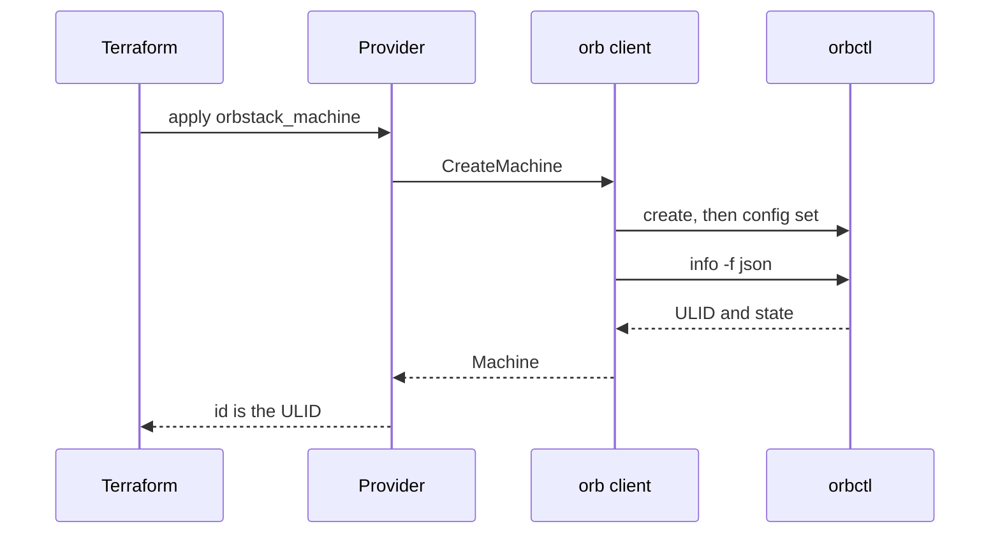

I wanted Terraform to make a Linux machine and a container on the Mac I already use. OrbStack was already running both. The existing providers were aimed at a smaller job, or at a much larger one.

The community OrbStack provider creates a machine and reads `orb info`. CPU, memory, disk, isolation, and mounts stay on the CLI. The Docker provider can run the container, and it expects an image resource, nested port blocks, and a socket you configure. That shape fits a cluster. It is a long file for nginx on port 8080.

[machugram/orbstack](https://registry.terraform.io/providers/machugram/orbstack/latest) is the provider I wrote for the laptop case. The project page is [[projects/orbstack | OrbStack Provider]]. Source is [github.com/machugram/terraform-provider-orbstack](https://github.com/machugram/terraform-provider-orbstack). `0.1.2` is the published version.

## Two clients, one schema

OrbStack exposes two control planes.

Linux machines are an `orbctl` feature. There is no documented HTTP API for them. `orbctl info -f json` returns a ULID, an image, and a state. Limits live in config keys such as `machine.<name>.cpu`.

Containers are Docker. OrbStack publishes `~/.orbstack/run/docker.sock`. Create, inspect, start, and remove are already Engine API calls. A `docker run` shell-out would mean parsing text the API returns as structs.

HashiCorp's rule for a new provider is that Terraform consumes an independent client, and that client does not import Terraform types. `internal/orb` owns `orbctl`. `internal/docker` owns `github.com/moby/moby/client`. `internal/provider` only maps schema and state. A new flag starts as a client function and a unit test on the arguments, then becomes an attribute.

```hcl
resource "orbstack_machine" "dev" {
  name       = "dev"
  image      = "ubuntu:noble"
  cpus       = 2
  memory_mib = 2048
  disk_gib   = 16
}

resource "orbstack_container" "web" {
  name  = "web"
  image = "nginx:latest"
  ports = { "8080" = "80" }
}
```

Apply on a machine calls `CreateMachine`. The client creates the VM, writes the limits, and reads the machine back. State stores the ULID.



Apply on a container pulls the image, creates it, starts it, and inspects it. The stored id is the container id. Destroy removes the container and leaves the image.

## What the plan is allowed to mean

**The id is the ULID.** `orbctl rename` keeps that id. Name updates in place. Using the name as the Terraform id would turn a rename into destroy and create, and an import after a rename outside Terraform would miss the machine.

**Replace only what create cannot change.** Image, architecture, user, cloud-init, isolation, and mounts force a new machine. CPU, memory, and disk are config keys, so they update in place. If the machine is running, the client restarts it, so the limit in config is the limit the VM is using. Replacing the machine to add one core would wipe the disk.

**Unlimited stays null.** OrbStack stores an unlimited CPU, memory, or disk as `0`. The client turns that `0` into null before the provider writes state. An unset `cpus` then stays unset when refresh reports unlimited.

**Refresh keeps the image string you wrote.** OrbStack expands `ubuntu` into a distro and a version. Writing that expansion back would replace the machine on every plan. Read leaves the configured reference alone.

**A container is one resource.** Ports, env, and volumes are maps from host to container. Create always pulls. Image, ports, env, volumes, command, workdir, CPUs, and memory replace the container, because the engine applies those by recreate. `restart` and `running` update in place. Networks, builds, healthchecks, and registry auth stay with a Docker provider pointed at the same socket.

**`go test` stays offline.** The failures worth pinning were local: a missing `--disk` flag, a `0` stored as `0`, a host port parsed as the container port, a port of `70000` accepted. Those tests run anywhere Go runs. They do not dial the socket, and they do not touch the Ubuntu machine already on the laptop. A live create, update, and destroy is a manual check with a disposable name.

## The version is the tag

The registry publishes a GitHub release it can verify: provider zips, `SHA256SUMS`, and a GPG signature of that file. `main.go` sets the version to `dev`. GoReleaser overwrites it while building a `v*` tag. Changing the string and pushing a branch publishes nothing.

The registry page is a fixed set of Markdown files on that same tag: `docs/index.md`, `docs/resources/`, and `docs/data-sources/`. `tfplugindocs` generates them from schema descriptions and examples. The README and the ADRs stay on GitHub.

`0.1.0` produced no assets. The first release looked for a main package at the module root, and the entrypoint lives under `cmd`. `0.1.1` is the first signed release. `0.1.2` adds the registry docs. Both are on [registry.terraform.io/providers/machugram/orbstack](https://registry.terraform.io/providers/machugram/orbstack/latest).

## Defaults still worth changing

A review of the command paths after `0.1.2` found four defaults the unit tests had not been asked to cover.

| | |
| --- | --- |
| Secrets | `cloud_init` and `env` are planned in plaintext. Neither attribute is sensitive. |
| Bind address | Published ports listen on `0.0.0.0`, so a laptop container is reachable from the LAN. |
| Flags | A machine `name` or `image` that starts with `-` is passed straight to `orbctl`, which can read it as a flag. |
| Volume paths | A container path may contain `:`, which is how extra bind options get into the mount string. |

Arguments are already separate, so a name cannot break into a shell. The fixes are on `fix/security-review`: sensitive write-only attributes, localhost unless you opt out, and rejection of flag-shaped values. They are not in `0.1.2`. The next version is a new tag once that branch is on `main`. Retagging `v0.1.2` would change checksums for anyone who already installed it.

## Left for a later pass

Kubernetes, Compose, image builds, custom networks, healthchecks, registry auth, and file copy onto a machine. `orbctl push` has no delete, so a file resource would create something Terraform cannot destroy.

The useful split is the small one. Machines stay on `orbctl`. Containers stay on the engine OrbStack already runs. The provider's job is to make the plan say which of those is about to happen.
