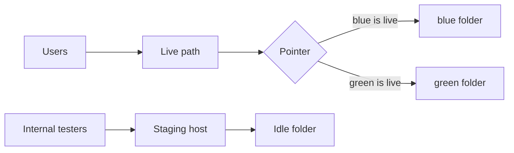
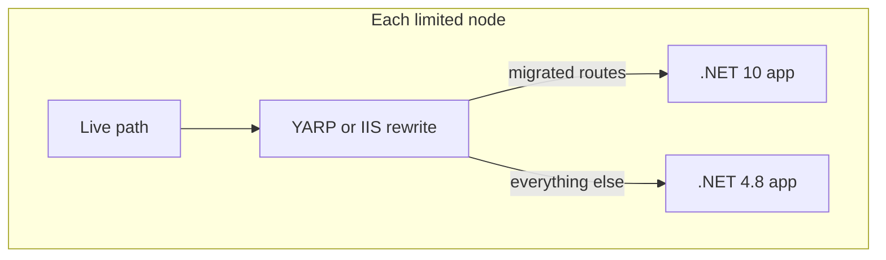
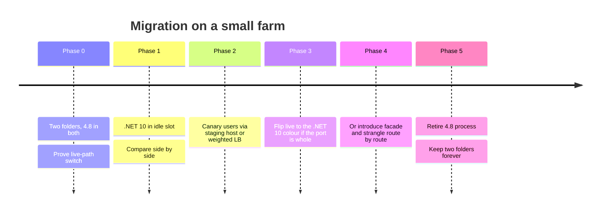

**Status:** Proposed  
**Audience:** Teams migrating a Windows-hosted ASP.NET app from .NET Framework 4.8 to .NET 10, on a small number of nodes.

This is written as an RFC, not a tutorial. Blue-green is how you compare 4.8 and .NET 10 on the boxes you already have. The decision, the constraints, and the rollback are the product.

## Summary

You cannot in-place upgrade .NET Framework 4.8 to .NET 10. Different CLR, different hosting model, different `web.config` contract. The useful move on a **small farm** is not a second cluster. It is two release folders on the nodes you already have, plus a **live path** that operators can point at one folder or the other.

Blue-green is the deploy primitive: build the candidate in `staging`, compare it with `live`, then switch users. Strangler Fig is the later migration tactic: once the switch exists, peel routes off 4.8 into .NET 10 behind the same live path. Limited nodes make that order mandatory. You do not get a parallel estate. You get two folders and a pointer.

## Motivation

A 4.8 app that still earns money usually has three problems at once:

1. **Runtime risk.** Framework 4.8 is in-support on Windows, but the ecosystem, hosting story, and hiring market have moved to modern .NET. Waiting does not make the gap smaller.
2. **Cutover risk.** A weekend big-bang rewrite fails in the ways rewrites always fail: unseen behaviour, session and cookie incompatibility, and no fast way back.
3. **Capacity risk.** There are not spare nodes to run a full shadow farm. Whatever we do has to fit on the boxes that already serve production.

Blue-green without extra hardware sounds like a contradiction. It is not, if “environment” means **a folder and an app pool**, not a subscription.

The end state this RFC asks for is deliberately small:

```
C:\apps\<site>\
  live      ← what users hit (junction, or the IIS physical path)
  blue\     ← slot A
  green\    ← slot B
```

`staging` is not a third copy. It is the **idle slot**, reached on an internal host or header, so people can compare before anyone is switched.

## Goals

- Deploy a candidate next to production without taking production down.
- Run .NET 4.8 and .NET 10 **side by side** on the same nodes long enough to compare behaviour.
- Switch the public live path in one operator action, and switch it back in one operator action.
- Keep both slots warm so a switch is a routing change, not a cold start.
- Leave a path to Strangler Fig later: a facade that can send some URLs to 4.8 and some to .NET 10 **without new machines**.
- Make expand/contract database changes the default, so either slot can be live at any moment.


## Non-goals

- A Kubernetes or extra-region rewrite as a prerequisite.
- Splitting the monolith into microservices in order to migrate.
- Sharing a process or app pool between Framework and modern .NET. That is not possible.
- Feature-flagging every line of business logic on day one. Flags help inside a slot. They are not a substitute for a slot switch.
- Moving off Windows in the same RFC. .NET 10 can leave IIS later. 4.8 cannot. Coexistence is a Windows problem first.


## Constraints

> [!warning] Limited nodes
> There is no spare farm. Peak working set must be sized for **two apps plus a facade**, not one. If the box cannot hold 4.8 and .NET 10 in memory at once, this RFC does not apply until that is true — or until you accept a brief single-slot window, which is not blue-green.

Other hard limits:

- **Two CLRs.** `w3wp` with .NET Framework 4 and an ASP.NET Core / .NET 10 worker are different processes. Separate app pools, always.
- **IIS is the front door.** Public bindings, certificates, and the live path live on the site. Folders do not own TLS.
- **Shared database.** We are not cloning production SQL per slot. Schema must remain compatible with both runtimes during the overlap.
- **Sticky local state is hostile.** In-memory session, local files as locks, a Windows Service that assumes one web root — these break a switch. They must be listed and dealt with before the first flip.


## Current state 

A small IIS farm. One site. One physical path. Publish overwrites that path, or Web Deploy syncs into it. Rollback means “find the last package and publish again,” which is slow and often not the same bits you just replaced.

That model cannot host 4.8 and .NET 10 at once. It also cannot compare them. The first change is the folder layout, while the runtime is still 4.8.

## Proposal


### 1. Two slots, one live path

Give every node the same layout:


| Path                   | Role                                                                 |
| ---------------------- | -------------------------------------------------------------------- |
| `C:\apps\<site>\blue`  | Slot A. Full published tree for that colour.                         |
| `C:\apps\<site>\green` | Slot B. Full published tree for that colour.                         |
| `C:\apps\<site>\live`  | Junction (or the site’s `physicalPath`) pointing at the active slot. |


IIS site **Public** uses `live` as its physical path, or — cleaner for Core — uses a rewrite / ARR rule that forwards to the active slot’s site.

IIS site **Staging** always points at the idle slot. Internal DNS, a second host header, or an allow-listed header (`X-Deployment-Slot: staging`) is enough. Staging must not be reachable from the public internet without a gate.




**Switch** means: warmup the idle slot, flip the pointer, confirm health on live, leave the previous slot running for rollback.

Do not copy files over `live`. Copying is not a switch. It is a deploy into production with a worse story.

### 2. Prove the switch on 4.8 first

Phase 0 ships **the same 4.8 app** to both folders. No new runtime.

If you cannot flip `live` from blue to green and back, with sessions, auth cookies, and background work intact, you are not ready to put .NET 10 in the other folder. The migration will hide operational bugs.

Warmup is part of the switch, not an afterthought:

- App pool `startMode="AlwaysRunning"` and Application Initialization (or a synthetic hit to `/health`) on the idle slot.
- For ASP.NET Core later: the ASP.NET Core Module and a readiness endpoint that checks DB, not only process up.
- Drain: stop sending new users, wait in-flight requests, then flip. On a small farm this is a load-balancer drain or a short `app_offline` on Framework if you must. Prefer drain-then-flip over hard recycle.


### 3. Side-by-side: 4.8 live, .NET 10 idle

Once the pointer works, green (or whichever is idle) becomes the .NET 10 candidate.

They cannot share an app pool. A colour folder is therefore a **bundle**:

```
green\
  net48\          Framework site, localhost only, own app pool
  net10\          ASP.NET Core / .NET 10, own app pool
  facade\         optional until strangler; may be net10 itself
```

Early on, `net10` may be a port of the whole app, or a thin host with a few routes. Staging traffic hits that bundle. Live stays on 4.8.

**Compare, do not guess.** Side-by-side means:

- The same contract tests against live and staging (HTTP status, payload shape, important headers).
- Shadow traffic where it is safe: duplicate reads to staging, **never** duplicate payments or other writes unless you have an idempotency story.
- Metric diffs: error rate, latency, SQL duration, GC / working set on the node.
- A cookie or group for staff to use the staging host in anger, not only in Postman.

> [!tip] Auth and cookies
> A switch that logs everyone out will be called a failure even if the new runtime is correct. Align ASP.NET Core Data Protection keys across slots and nodes, or keep the Framework `machineKey` stable, before you flip. Treat cookie compatibility as a go/no-go.


### 4. The live path is the only user-facing switch

Operators need one documented action:

```powershell
# Conceptual. Wrap this in a script with health checks.
# 1. Warm staging  2. Flip junction or IIS physicalPath  3. Probe live  4. Keep old slot up
```

What users are switched **to** is always `live`. They are never told to use a port or a folder name. Staging stays a comparison surface until you decide it is the new live.

Rollback is the same script in reverse. The previous slot is still the previous bits. If you deploy over the idle slot after a flip, you have destroyed rollback. Idle is sacred until the next release is deliberately started.

### 5. Eventually: Strangler Fig on the same nodes

Blue-green moves **a whole colour**. Strangler Fig moves **a capability**.

With spare nodes, people put a proxy farm in front and grow a new service beside the old one. You do not have those nodes. The facade lives **in the colour folder**, on localhost:




YARP in the .NET 10 process is the default recommendation: one public site, path (and later host) rules, forwarded headers, and a single place to add a route when a slice is ready. IIS ARR can do the same if the team already operates it. Do not run both as competing sources of truth.

Release unit stays the **colour**, not the slice. You still blue-green the whole bundle (`facade + net48 + net10`). That way a bad strangler route rolls back with the pointer, instead of leaving live on a half-applied rewrite map.

Order of extraction (typical, not sacred):

1. Read-mostly, low-auth endpoints (health, public content, simple GETs).
2. Authenticated reads that share the same token/cookie story.
3. Writes behind idempotency and expand/contract schema.
4. The last Framework-only corners (legacy SOAP, `System.Web` modules, third-party ISAPI).

When `net48` serves nothing, remove the process from the bundle. Keep the two folders. Blue-green does not retire when Framework does. It becomes ordinary .NET 10 delivery on the same live path.




Phase 3 and Phase 4 are alternatives, not a sequence you must finish in order. If the port of the whole app is honest and comparable, a live-path flip is enough. If it is not, do not fake a flip. Strangle.

## Data and state

Shared SQL is the usual right call on limited nodes. Rules:

- **Expand/contract.** Add columns and tables compatible with 4.8 *before* the .NET 10 code that needs them is live. Remove old columns only after both slots have stopped reading them.
- **No dual-write unless you must.** Dual-write is how strangler data gets out of sync. Prefer one writer. If you dual-write, you need a reconciliation job and a time-box.
- **Jobs.** Hangfire, Quartz, Windows Task Scheduler, and “a console exe on the box” must bind to a slot or to a single elected worker. Two live colours processing the same queue is a class of incident, not a feature.
- **Files.** Uploads go to a share or object storage, not `App_Data` under the slot. A flip must not orphan blobs.


## Risks


| Risk                              | Why it happens                              | Mitigation                                                                                                 |
| --------------------------------- | ------------------------------------------- | ---------------------------------------------------------------------------------------------------------- |
| Node memory                       | Two CLRs + facade                           | Measure working set in Phase 0 with both pools running; add RAM or drop shadow traffic before Phase 1      |
| Cookie / Data Protection mismatch | Users bounce at login after flip            | Shared keys, tested on staging host with production-like domain                                            |
| Schema ahead of old slot          | Rollback becomes impossible                 | Expand/contract; never ship a breaking migration with a runtime flip                                       |
| Idle slot overwritten             | No rollback                                 | Pipeline rule: do not publish to idle until N hours after a successful flip, or until explicitly abandoned |
| Localhost strangler loops         | Facade proxies to itself                    | Separate bindings, explicit ports, health checks that fail closed                                          |
| “Almost compatible” port          | Flip looks green, business process is wrong | Side-by-side contract tests + staff-on-staging before any public switch                                    |


## Alternatives considered

**In-place upgrade of the existing folder.** Impossible as a runtime move. Overwriting `live` with .NET 10 is a one-way publish. Rejected.

**A second farm / cloud slot swap.** Correct if you have the nodes or Azure slot swap on App Service. This RFC exists because we do not. If capacity appears later, the same mental model maps onto it: staging vs live. The folders are the poor-hardware version of slots.

**Big-bang rewrite on a branch, then one IIS publish.** Cheapest to start, most expensive to reverse. Rejected as the *only* plan. A rewrite can still happen **inside** the idle slot.

**Strangler first, no blue-green.** On a large platform this is normal. On few nodes, a strangler without a slot switch means every extracted route is a live edit of the only tree. You will ship facade bugs with no pointer to revert. Rejected as the starting move.

**Containers on the same VMs.** Fine as an implementation of the two folders (`blue` and `green` as compose projects). Not required. IIS + two directories is enough and matches how 4.8 already runs.

## Success metrics

Phase 0 is done when a 4.8 → 4.8 live-path flip and flip-back complete inside the agreed window (target: under a minute of user-visible disruption, ideally none), and rollback is the same script.

Phase 1 is done when staging (.NET 10) passes the contract suite against the same fixtures as live, and staff can use the staging host for a real workflow.

A public switch is done when error budget and the handful of “money paths” stay inside bounds for the observation window, and the previous slot is still intact.

Strangler progress is **routes (or bounded contexts) off 4.8**, not lines of code rewritten. Track the percentage of production requests whose terminal handler is `net10`.

## Open questions

- Is the public site one host or several? Multiple hosts may need one pointer per site, or a shared facade.
- Can we afford both pools AlwaysRunning on every node, or only on a canary node first?
- Where do Data Protection keys / `machineKey` live today, and can every node read the same store?
- Which writes are unsafe to shadow? List them by name.
- Is there a Windows Service or COM component that is secretly part of the web app?
- Who is allowed to run the switch script — CI, or a human with a checklist?


## Appendix: writing this kind of RFC

A migration RFC that people can execute is short on vision and long on **switch, compare, rollback**. The shape used here is the recommendation:

1. **One decision.** Here: two folders and a live path as the primitive; strangler later. If you need a second decision (new database, new IdP), that is another RFC.
2. **Summary first.** A reader who stops after the first section should still know the end state.
3. **Goals and non-goals.** Non-goals stop the thread from becoming “while we are at it, Kubernetes.”
4. **Constraints as first-class.** Limited nodes are not a footnote. They choose the design.
5. **A picture of the switch.** If you cannot draw what operators flip, you do not have a proposal.
6. **Phased rollout that can stop.** Phase 0 must be valuable even if .NET 10 never ships.
7. **Alternatives with reasons they lost.** So the next review does not re-litigate App Service from scratch.
8. **Open questions that are actually open.** Fake certainty is how these migrations skip cookie keys and job locks.

Status belongs at the top so the document can move from Proposed to Accepted to Superseded without rewriting the argument.