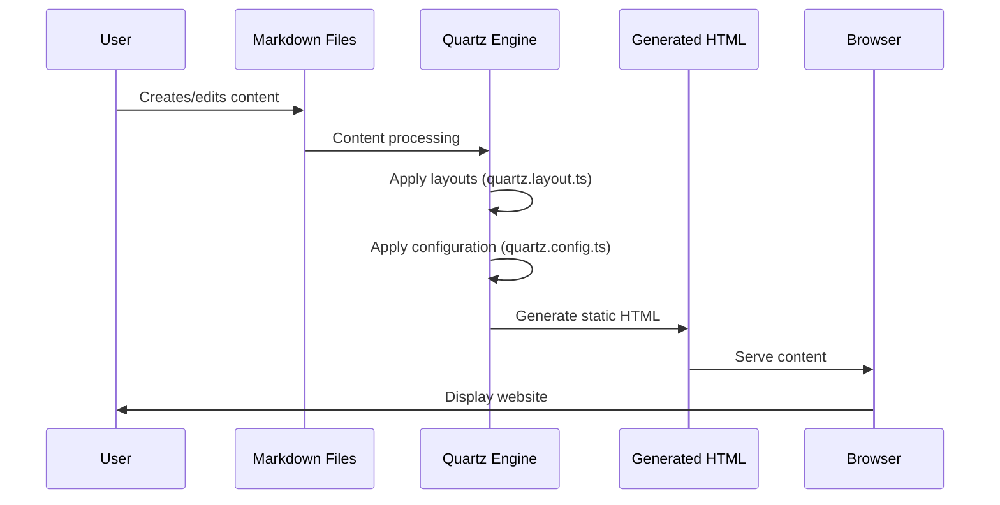

Quartz Documentation: Digital Garden Framework
Overview
This documentation covers the Quartz framework, a digital garden/knowledge base system that helps users build and maintain personal websites, portfolios, and knowledge bases. Quartz appears to be built around markdown content with advanced features for organizing and presenting information.

Architecture
Quartz follows a static site generation approach, processing markdown content into HTML pages that can be deployed on various hosting platforms.

Core Components
Content Management: Markdown files in the content directory
Layout System: Defined in quartz.layout.ts
Configuration: Controlled via quartz.config.ts
Build System: TypeScript-based build process
Directory Structure
content: All markdown content files
/posts: Blog posts and articles
/projects: Project documentation
/assets: Media files and resources
quartz: Core framework code
public: Static assets and output files
docs: Framework documentation
Data Flow
The following diagram illustrates how data flows through the Quartz system from content creation to final rendered output:

    Quartz ->> HTML: Generate static HTML
Key Features
Markdown-based Content: All content is written in standard markdown with potential extensions
Custom Layouts: Configurable through quartz.layout.ts
TypeScript Configuration: Site behavior controlled via quartz.config.ts
Docker Support: Containerization available via provided Dockerfile
Git Integration: Version control and collaboration using Git
Getting Started
Adding Content
Place markdown files in the content directory. The basic structure is:

index.md - Your home page
posts - Blog posts
projects - Project information
Configuration
Customize site behavior by editing quartz.config.ts. This controls site metadata, plugins, and other global settings.

Layout
Adjust the site's structure and appearance by modifying quartz.layout.ts, which defines how pages are composed.

Building the Site
The build process likely uses TypeScript/Node.js. Refer to the package.json scripts for specific build commands.

Deployment
Quartz supports various deployment options:

Standard Web Hosting: Upload the built static files
Containerized Deployment: Use the provided Dockerfile
GitHub Pages: Potentially supported through GitHub workflows
See hosting.md and build.md for detailed deployment instructions.

Best Practices
Follow the project recommendations outlined in the copilot-instructions.md file:

Maintain small, focused components
Use proper semantic HTML
Ensure responsive design
Follow accessibility standards
Optimize for performance through proper image handling and code splitting
Additional Resources
For more detailed information, refer to the comprehensive documentation in the docs directory, which includes:

Authoring Content Guide
Configuration Options
Layout Customization
Migration Guides from previous versions

## Data Flow

The following diagram illustrates how data flows through the Quartz system from content creation to final rendered output:

Key Features
Markdown-based Content: All content is written in standard markdown with potential extensions
Custom Layouts: Configurable through quartz.layout.ts
TypeScript Configuration: Site behavior controlled via quartz.config.ts
Docker Support: Containerization available via provided Dockerfile
Git Integration: Version control and collaboration using Git
Getting Started
Adding Content
Place markdown files in the content directory. The basic structure is:

index.md - Your home page
posts - Blog posts
projects - Project information
Configuration
Customize site behavior by editing quartz.config.ts. This controls site metadata, plugins, and other global settings.

Layout
Adjust the site's structure and appearance by modifying quartz.layout.ts, which defines how pages are composed.

Building the Site
The build process likely uses TypeScript/Node.js. Refer to the package.json scripts for specific build commands.

Deployment
Quartz supports various deployment options:

Standard Web Hosting: Upload the built static files
Containerized Deployment: Use the provided Dockerfile
GitHub Pages: Potentially supported through GitHub workflows
See hosting.md and build.md for detailed deployment instructions.

Best Practices
Follow the project recommendations outlined in the copilot-instructions.md file:

Maintain small, focused components
Use proper semantic HTML
Ensure responsive design
Follow accessibility standards
Optimize for performance through proper image handling and code splitting
Additional Resources
For more detailed information, refer to the comprehensive documentation in the docs directory, which includes:

Authoring Content Guide
Configuration Options
Layout Customization
Migration Guides from previous versions